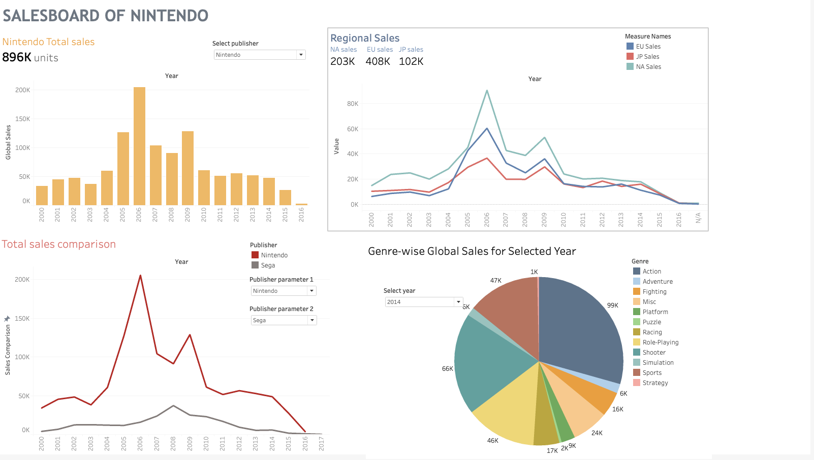

# Nintendo Sales Dashboard 🎮

This repository contains a Tableau dashboard that visualizes Nintendo's video game sales over the years. The dashboard not only compares Nintendo's performance with other publishers but also highlights key insights, including the year with the highest sales. In addition, it breaks down global sales into regional segments (North America, Europe, and Japan) and features a pie chart showing the distribution of game release years.

## Dashboard Features 📊

- **Yearly Sales Comparison:** 📈  
  Compare Nintendo's sales trends over the years with those of other major publishers using interactive visualizations.

- **Highest Sales Year:** 🏆  
  Identify the specific year in which Nintendo achieved its highest sales, offering a clear benchmark for success.

- **Regional Sales Breakdown:** 🌍  
  Analyze sales data on a regional level including:
  - **North America (NA)**
  - **Europe (EA)**
  - **Japan (JP)**
  
- **Global Sales Overview:** 🌐  
  View an aggregated global sales performance that combines all regions.

- **Release Year Analysis:** 📆  
  Explore a pie chart that depicts the distribution of game releases by year, providing insights into the timing and impact of releases.

## Data Overview 🗂️

The dashboard is built on a comprehensive dataset that includes:
- **Publisher:** The game publisher (e.g., Nintendo, others).
- **Year:** The year the game was released.
- **Global Sales:** Total worldwide sales figures.
- **Regional Sales:** Sales data for North America (NA), Europe (EA), and Japan (JP).
- **Release Year:** Data used to generate the pie chart for release distributions.

## How to Get Started 🚀

1. **Clone the Repository:**
   ```bash
   git clone https://github.com/sharathkum05/Nintendo-Dashboard.git
## Open the Tableau Workbook

- Locate the Tableau packaged workbook file (.twbx) included in the repository.
- Open it using Tableau Desktop.

## Interact with the Dashboard

- **Filters:** Use available filters to explore specific publishers or regions.
- **Tooltips:** Hover over charts to see detailed data points.
- **Interactive Charts:** Click on segments (e.g., the pie chart) for a closer look at the release year distribution.
## Screenshots

Below is the sample screenshot of the dashboard 

 

## License

This project is licensed under the MIT License.

## Acknowledgments

Special thanks to the data providers and the Tableau community for their invaluable resources.  
Additional thanks to everyone contributing to this project and helping to improve it.

*Happy analyzing and visualizing!*


